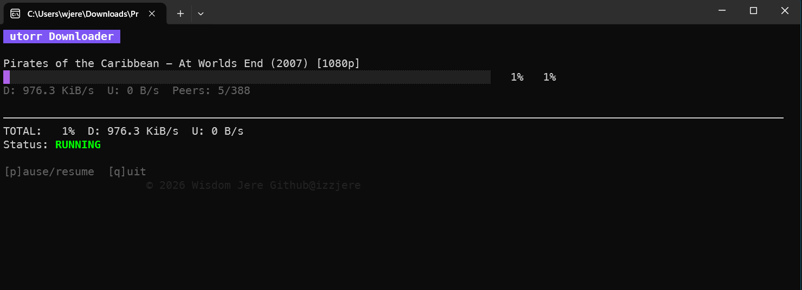

# utorr

A secure, fast, multi-threaded torrent downloader with resume capabilities.

## Installation

Just download the pre built binaries from the release section or build your own binaries 👇🏾

Ensure you have Go 1.24+ and (make)installed.

```bash
# Fetch dependencies
go mod tidy

# Build the project (defaults to CGO_ENABLED=0 for portability)
make

# Build with CGO enabled (e.g., if you need native SQLite or other C features)
make CGO_ENABLED=1
```

## Usage

# Run
./utorr [options] <magnet|file>
```

### UI & Performance Notes

- **Full TUI**: The downloader now features a proper Terminal User Interface (TUI) with real-time progress bars, per-torrent stats, and global download/upload rates.
- **Interactive Commands**:
  - `p`: Toggle **Pause/Resume** (instant, no Enter required).
  - `q`: **Quit** gracefully (instant, no Enter required).
- **WSL/Linux Performance**: If you are using WSL, running the binary from a Windows mount (`/mnt/c/...`) can be significantly slower due to filesystem interop. For the fastest startup, move the project to the native Linux filesystem (e.g., `~/utorr`).

### Options

- `-o <dir>`: Output directory (default: `downloads`)
- `-session <dir>`: Session data directory (default: `session`)
- `-input <dir>`: Input directory for new .torrent/.magnet files (default: `input`)
- `-log <file>`: Path to log file (default: `utorr.log`)
- `-max-conns <n>`: Max peer connections (default: 80)
- `-seed`: Seed after completion
- `-disable-utp`: Disable uTP
- `-disable-ipv6`: Disable IPv6

### Multi-File & Input Directory

The downloader now supports adding torrents dynamically while it's running:
1. **Start without arguments**: You can run `./builds/utorr` without any magnet links or files.
2. **Input directory**: Simply drop a `.torrent` file or a `.magnet` text file (containing a magnet link) into the `input/` directory. The downloader will automatically detect and start downloading them.

### Error Handling & Logging

All significant events (adding torrents, start of download, errors) are logged to `utorr.log` (or your custom log file) to keep the TUI clean.

### Interactive Commands

During download:
- `p`: Toggle pause/resume
- `q`: Quit gracefully (state is saved)

### Demo


### What's Next?
1. Integration with a web UI for remote control
2. Docker support for easy deployment