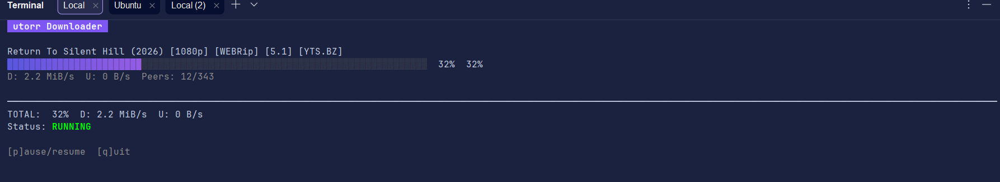

# utorr

A secure, fast, multi-threaded torrent downloader with resume capabilities.

## Installation

Ensure you have Go 1.24+ installed.

```bash
# Fetch dependencies
go mod tidy

# Build the project (defaults to CGO_ENABLED=0 for portability)
make

# Build with CGO enabled (e.g., if you need native SQLite or other C features)
make CGO_ENABLED=1
```

## Usage

For best performance and a clean UI, use the compiled binary:

```bash
# Build (one-time or after changes)
make

# Run
./builds/utorr [options] <magnet|file>
```

### UI & Performance Notes

- **Full TUI**: The downloader now features a proper Terminal User Interface (TUI) with real-time progress bars, per-torrent stats, and global download/upload rates.
- **Interactive Commands**:
  - `p`: Toggle **Pause/Resume** (instant, no Enter required).
  - `q`: **Quit** gracefully (instant, no Enter required).
- **WSL/Linux Performance**: If you are using WSL, running the binary from a Windows mount (`/mnt/c/...`) can be significantly slower due to filesystem interop. For the fastest startup, move the project to the native Linux filesystem (e.g., `~/utorr`).

### Options

- `-o <dir>`: Output directory (default: `downloads`)
- `-session <dir>`: Session data directory (default: `session`)
- `-max-conns <n>`: Max peer connections (default: 80)
- `-seed`: Seed after completion
- `-disable-utp`: Disable uTP
- `-disable-ipv6`: Disable IPv6

### Interactive Commands

During download:
- `p`: Toggle pause/resume
- `q`: Quit gracefully (state is saved)

### Demo


### What's Next?
1. Multi-file downloads
2. Magnet link parsing and handling
3. Support for multiple trackers per torrent
4. Enhanced error handling and logging
5. Integration with a web UI for remote control